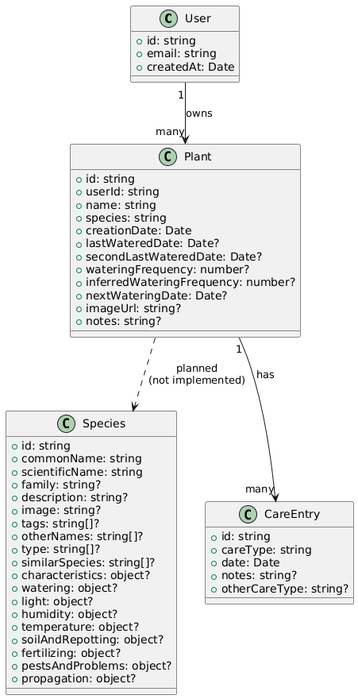

# Purpose

This folder contains documentation related to the application's data layer. It defines the structure of the data, the relationships between entities, and the conventions used across the database.  
Included in this folder:

- The ERD (Entity–Relationship Diagram)
- Entity models
- Firestore structure notes
- Rules and constraints

# ERD

# Entities

- **[Plant](./models/plant.md)**
- **Species** — encyclopedia entries
- **[User](./models/user.md)** — owner of plants
- **History** — plant care events (watering, fertilizing, etc.)

# Firestore Structure

This section outlines how Firestore is organized conceptually.

- Collections and subcollections
- Document paths
- High‑level structure of stored data

# Conventions

General conventions used across all database entities:

- **Naming conventions**
  - camelCase for field names
  - singular collection names
- **ID conventions**
  - Firestore auto‑generated IDs unless otherwise specified
- **Timestamps**
  - Stored as Firestore `Timestamp` values
  - Interpreted as JavaScript `Date` objects in the application
- **Optional vs required fields**
  - Required fields must always be present
  - Optional fields may be omitted or null

# How to update

To keep the documentation consistent:

1. **Update the ERD first** - Add or modify entities and relationships

2. **Update the model pages** - Reflect any new fields, constraints, or examples

3. **Update Firestore structure notes** - Adjust collection paths or structural changes

This ensures the ERD, models, and Firestore documentation remain aligned.
